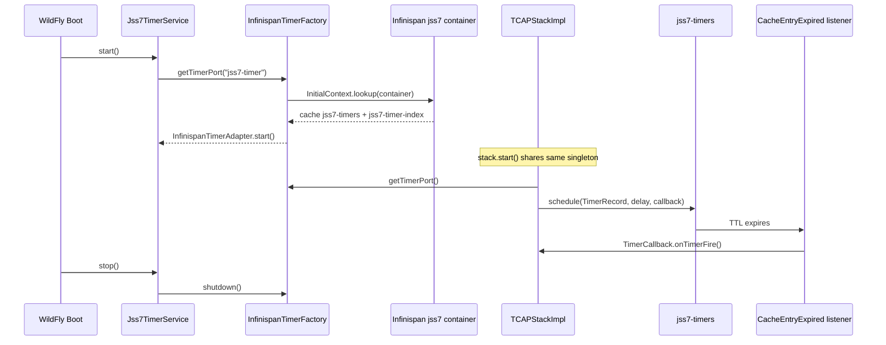
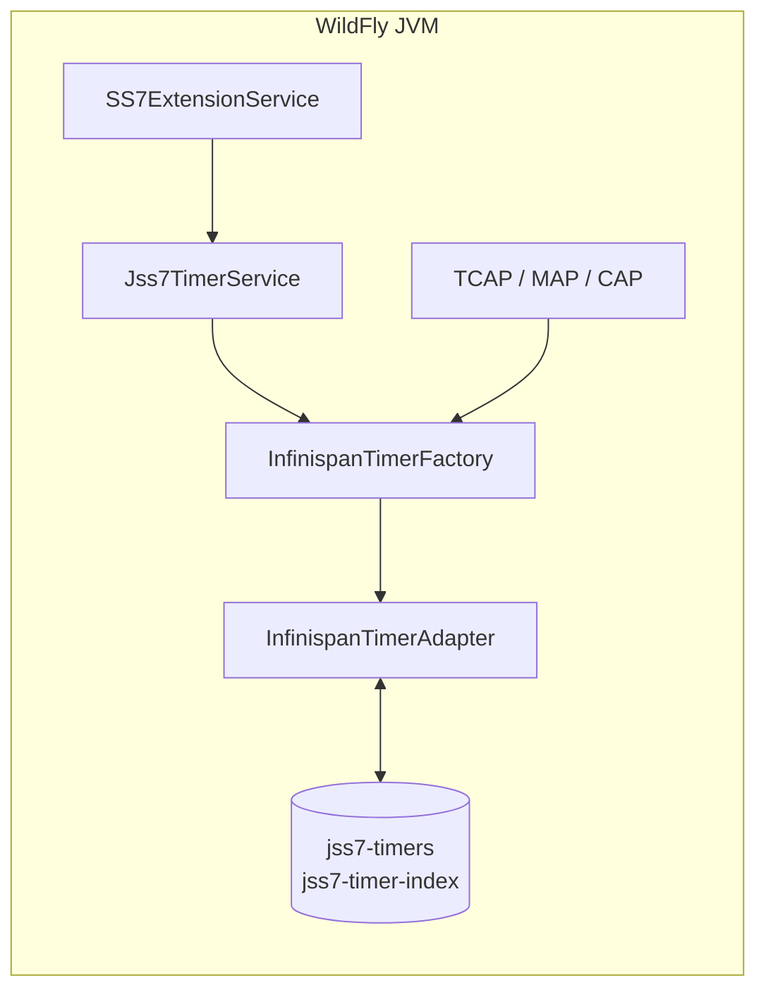
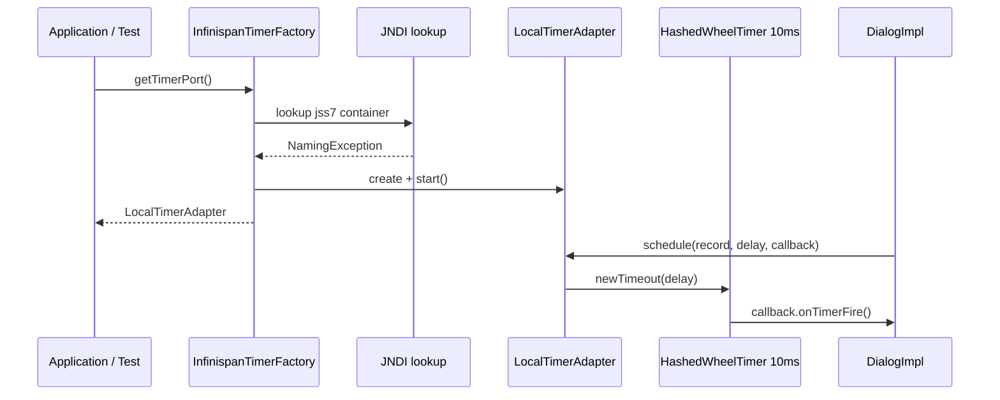
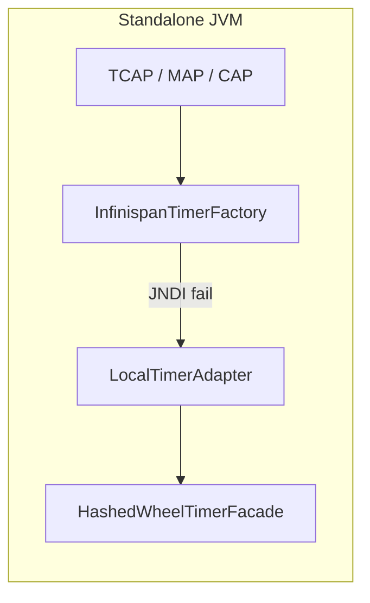
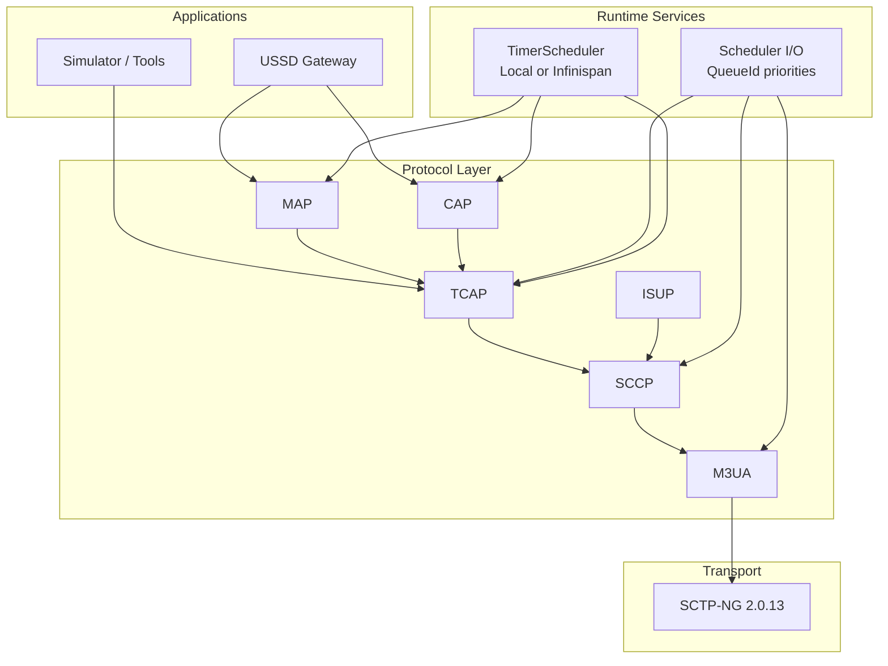
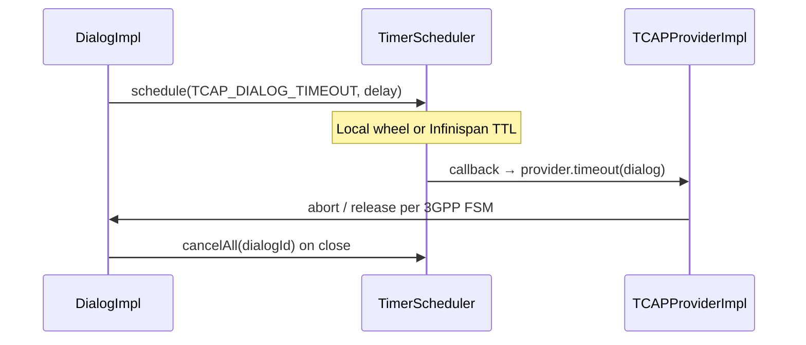

# RestComm jSS7 9.5.0

High-performance SS7 protocol stack for MAP, CAP, TCAP, SCCP, M3UA, ISUP, and SCTP transport.  
Built on JCTools lock-free collections, Netty zero-copy I/O, and a unified timer subsystem with optional WildFly Infinispan clustering.

[](https://github.com/nhanth87/jSS7)
[](pom.xml)

---

## Infinispan Timer Deployment

jSS7 9.5.0 separates **two schedulers** that must not be confused:

| Component | Package | Role | Infinispan |
|-----------|---------|------|------------|
| **I/O Scheduler** | `org.restcomm.protocols.ss7.scheduler.Scheduler` | Protocol I/O prioritization (11 queues, ~4 ms cycle) | No |
| **Timer Scheduler** | `org.restcomm.protocols.ss7.scheduler.api.TimerScheduler` | TCAP/MAP/CAP protocol timers (idle, invoke, guard) | Optional (WildFly) |

**Design rule:** jSS7 never embeds Infinispan. The `scheduler` module declares `infinispan-core` as `provided`. At runtime the factory tries WildFly JNDI; if unavailable it falls back to a local Netty `HashedWheelTimer` (10 ms tick).

Full reference: [`docs/INFINISPAN_TIMER_GUIDE.md`](docs/INFINISPAN_TIMER_GUIDE.md)

---

### WildFly deployment

Use when jSS7 runs inside WildFly (USSD Gateway, SS7 extension) and you want timer metadata in the Infinispan subsystem — required for multi-node HA timer index/TTL.

**1. Add cache container** to `standalone.xml` (snippet: `service/wildfly/extension/src/main/resources/standalone-jss7-cache-snippet.xml`):

```xml
<cache-container name="jss7" default-cache="jss7-timers"
                 module="org.wildfly.clustering.server">
    <local-cache name="jss7-timers">
        <locking isolation="READ_COMMITTED"/>
        <expiration max-idle="-1" lifespan="-1" interval="1000"/>
    </local-cache>
    <local-cache name="jss7-timer-index">
        <locking isolation="READ_COMMITTED"/>
        <expiration max-idle="3600000" interval="60000"/>
    </local-cache>
</cache-container>
```

For HA, replace `<local-cache>` with `<distributed-cache owners="2">` and configure JGroups transport (`standalone-full-ha.xml`).

**2. Lifecycle** — managed by the SS7 WildFly extension (no application code required):

```java
// SS7ExtensionService boot / shutdown
Jss7TimerService.start();
Jss7TimerService.stop();
```

**3. Verify** — server log on startup:

```
jSS7 timer service started (InfinispanTimerAdapter)
```

| JNDI / cache | Purpose |
|--------------|---------|
| `java:jboss/infinispan/container/jss7` | Container lookup |
| `jss7-timers` | `TimerRecord` entries with per-entry TTL |
| `jss7-timer-index` | `dialogId → Set<timerId>` for bulk cancel |

**WildFly timer flow:**





**Important:** `TCAPStackImpl.stop()` does **not** stop the shared `TimerScheduler`. Only `Jss7TimerService.stop()` shuts down the process-wide singleton.

---

### Standalone / simulator / CI

Use when running outside WildFly: simulator, Maven tests, embedded stack, or single JVM without cache configuration.

No Infinispan configuration is required. `InfinispanTimerFactory.getTimerPort()` attempts JNDI, logs a warning, and creates `LocalTimerAdapter` automatically.

```java
// TCAP — automatic on stack.start()
TCAPStackImpl stack = new TCAPStackImpl("sim", sccpProvider, 8);
stack.start();  // binds InfinispanTimerFactory.getTimerPort() internally
```

**Standalone timer flow:**





**Tests** — inject a mock scheduler if needed:

```java
LocalTimerAdapter local = new LocalTimerAdapter("test-timer");
local.start();
InfinispanTimerFactory.setScheduler(local);
// ...
InfinispanTimerFactory.shutdown();
InfinispanTimerFactory.reset();
```

---

### When to use which mode

| Scenario | Mode | Action |
|----------|------|--------|
| WildFly USSD GW / SS7 extension | Infinispan (or local fallback) | Merge `jss7` cache snippet; deploy 9.5.0 module |
| WildFly HA cluster | Infinispan distributed | `distributed-cache` + JGroups |
| Simulator, unit tests, embedded JVM | Local only | None — automatic fallback |
| Custom app on same WildFly as jSS7 | Separate container | Do not share `jss7` caches — use dedicated JNDI (see guide §6.5) |
| Embedded Infinispan inside jSS7 JAR | **Not supported** | Use WildFly subsystem or standalone local wheel |

---

## Architecture



**Protocol timer path (TCAP example):**



---

## Build

```bash
mvn clean install -DskipTests
```

Run scheduler regression tests:

```bash
mvn test -pl scheduler
```

---

## Maven coordinates

```xml
<dependency>
    <groupId>org.restcomm.protocols.ss7</groupId>
    <artifactId>ss7-parent</artifactId>
    <version>9.5.0</version>
</dependency>
```

Timer API for custom modules:

```xml
<dependency>
    <groupId>org.restcomm.protocols.ss7.scheduler</groupId>
    <artifactId>scheduler</artifactId>
    <version>9.5.0</version>
</dependency>
```

---

## Stack highlights

| Area | Technology |
|------|------------|
| Collections | JCTools `MpscArrayQueue`, `NonBlockingHashMap` |
| Serialization | Jackson XML + Woodstox (WildFly 10 compatible) |
| Transport | SCTP-NG zero-copy Netty `ByteBuf` pipeline |
| Timers | Netty `HashedWheelTimer`; optional WildFly Infinispan HA |
| Modules | 84 Maven modules (MAP, CAP, TCAP, SCCP, M3UA, ISUP, OAM, tools) |

---

## WildFly 10 notes

- Configure Jackson XML with explicit Woodstox `WstxInputFactory` / `WstxOutputFactory` (StAX compatibility).
- Set `DeserializationFeature.FAIL_ON_UNKNOWN_PROPERTIES = false` for legacy XML state files.
- WildFly module: include `org.apache.logging.log4j.api` for Netty 4.2.x.

---

## Documentation

| Document | Content |
|----------|---------|
| [`docs/INFINISPAN_TIMER_GUIDE.md`](docs/INFINISPAN_TIMER_GUIDE.md) | Timer deployment, JNDI, HA, code examples |
| [`docs/TIMER_REFACTOR_PLAN.md`](docs/TIMER_REFACTOR_PLAN.md) | Design phases, SCCP/ISUP follow-up, dialog state epic |
| [`docs/JAINSLEE_SCHEDULER_INTEGRATION.md`](docs/JAINSLEE_SCHEDULER_INTEGRATION.md) | JAIN-SLEE timer/event integration analysis |

---

## Changelog

### 9.5.0
- Unified `TimerScheduler` API for TCAP, MAP, CAP protocol timers
- WildFly Infinispan integration via JNDI (`jss7-timers`, `jss7-timer-index`)
- Automatic `LocalTimerAdapter` fallback for standalone and simulator
- Scheduler I/O lifecycle fixes (graceful shutdown, `QueueId` enum)
- Documentation: Infinispan guide, JAIN-SLEE integration report

### 9.3.0
- Zero-copy SCTP → M3UA → SCCP → MAP pipeline
- Timer refactor foundation (scheduler module, WildFly extension)

### 9.2.x
- JCTools migration, Jackson XML serialization, SCTP-NG 2.0.13

---

## License

GNU Lesser General Public License v2.1

**Maintainer:** [nhanth87](https://github.com/nhanth87/jSS7)
