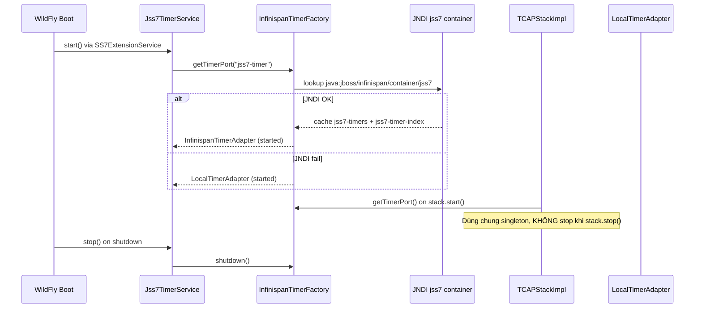

# jSS7 9.4.0 — Hướng dẫn Timer + Infinispan

**Phiên bản:** 9.4.0  
**Đối tượng:** vận hành WildFly, tích hợp USSDGW, developer protocol stack

---

## 1. Hai khái niệm dễ nhầm

| Thành phần | Vai trò | Infinispan? |
|------------|---------|-------------|
| **`Scheduler`** (`org.restcomm.protocols.ss7.scheduler.Scheduler`) | I/O event dispatcher — 11 priority queue, chu kỳ ~4 ms | **Không** |
| **`TimerScheduler`** (`scheduler/api/TimerScheduler`) | Protocol timers — TCAP idle/invoke, MAP/CAP guard | **Có thể** (qua WildFly) |

jSS7 9.4.0 chỉ dùng Infinispan cho **protocol timers** (`TimerScheduler`), không phải cho I/O scheduler.

---

## 2. Nguyên tắc thiết kế: không embed Infinispan trong jSS7

```
jSS7 JAR (scheduler, tcap-impl, …)
  └── infinispan-core scope = provided   ← chỉ compile, KHÔNG đóng gói vào artifact
  └── runtime: lookup JNDI WildFly HOẶC fallback LocalTimerAdapter
```

**jSS7 không khởi tạo `DefaultCacheManager` embedded.** Nếu không có WildFly Infinispan subsystem → tự động dùng Netty `HashedWheelTimer` local.

Lý do:
- Tránh xung đột phiên bản Infinispan với WildFly module
- HA/clustering do WildFly + JGroups quản lý, không duplicate trong stack library
- Simulator / unit test chạy được mà không cần cache server

---

## 3. Khi nào dùng mode nào?

### 3.1 `LocalTimerAdapter` (mặc định, không cần Infinispan)

**Dùng khi:**
- Chạy **simulator**, **Maven test**, **standalone JVM** (không WildFly)
- WildFly **single-node** và chấp nhận timer mất khi JVM restart (timer chỉ sống trong process)
- Dev/local không cần timer survive node failover

**Cách hoạt động:** `InfinispanTimerFactory` thử JNDI → fail → log WARNING → tạo `LocalTimerAdapter` (10 ms wheel tick).

**Không cần cấu hình gì thêm.** Chỉ start TCAP/MAP/CAP stack như bình thường.

### 3.2 `InfinispanTimerAdapter` (WildFly-managed cache)

**Dùng khi:**
- jSS7 chạy **trong WildFly** (USSDGW, SS7 extension)
- Cần timer metadata **đồng bộ cluster** (HA 2+ node)
- Cần `cancelAll(dialogId)` nhất quán trên nhiều node (index cache)

**Yêu cầu:** cấu hình `standalone.xml` / `standalone-patched.xml` với cache-container `jss7`.

### 3.3 Embedded Infinispan — khi nào?

| Tình huống | Khuyến nghị |
|------------|-------------|
| jSS7 trong WildFly | **Không embed** — dùng WildFly Infinispan subsystem |
| jSS7 standalone + cần HA timer | **Không hỗ trợ sẵn** trong 9.4.0; deploy lên WildFly hoặc tự host Infinispan Server riêng + JNDI (ngoài scope jSS7) |
| Custom app ngoài WildFly, single node | **Không cần Infinispan** — `LocalTimerAdapter` đủ |
| Test tích hợp Infinispan | Dùng mock cache (`TtlMockCache`) trong `scheduler` tests |

**Kết luận:** với jSS7 9.4.0, **không có trường hợp chính thức cần embed Infinispan trong jSS7 JAR.** Embedded chỉ có ý nghĩa nếu bạn tự viết bootstrap ngoài jSS7 (không được maintain trong repo).

---

## 4. Kiến trúc runtime



**Lifecycle quan trọng:**
- **Start:** `Jss7TimerService.start()` (WildFly) hoặc lần đầu `getTimerPort()` (test/simulator)
- **Stop:** chỉ `Jss7TimerService.stop()` / `InfinispanTimerFactory.shutdown()` khi **tắt toàn JVM**
- `TCAPStackImpl.stop()` **không** gọi `timerScheduler.stop()` — tránh kill singleton dùng chung

---

## 5. Cấu hình WildFly

### 5.1 Single-node (dev / USSDGW hiện tại)

Merge snippet vào `<subsystem xmlns="urn:jboss:domain:infinispan:4.0">`:

File mẫu: `service/wildfly/extension/src/main/resources/standalone-jss7-cache-snippet.xml`

Đã deploy trong USSDGW: `ussdgateway/release-wildfly/standalone-patched.xml`

```xml
<cache-container name="jss7" default-cache="jss7-timers"
                 module="org.wildfly.clustering.server">
    <local-cache name="jss7-timers">
        <locking isolation="READ_COMMITTED"/>
        <expiration max-idle="-1" lifespan="-1" interval="1000"/>
    </local-cache>
    <local-cache name="jss7-timer-index">
        <locking isolation="READ_COMMITTED"/>
        <expiration max-idle="3600000" interval="60000"/>
    </local-cache>
</cache-container>
```

**JNDI names:**

| Resource | JNDI |
|----------|------|
| Container | `java:jboss/infinispan/container/jss7` |
| Timers cache | `jss7-timers` (via `container.getCache("jss7-timers")`) |
| Index cache | `jss7-timer-index` |

### 5.2 HA cluster (2+ node)

Dùng `standalone-full-ha.xml` (hoặc domain profile), thay `<local-cache>` bằng:

```xml
<cache-container name="jss7" default-cache="jss7-timers"
                 module="org.wildfly.clustering.server">
    <transport lock-timeout="60000"/>
    <distributed-cache name="jss7-timers" owners="2" segments="64">
        <locking isolation="READ_COMMITTED"/>
        <expiration max-idle="-1" lifespan="-1" interval="1000"/>
    </distributed-cache>
    <distributed-cache name="jss7-timer-index" owners="2" segments="64">
        <locking isolation="READ_COMMITTED"/>
        <expiration max-idle="3600000" interval="60000"/>
    </distributed-cache>
</cache-container>
```

Đảm bảo JGroups transport stack (`tcp`/`udp`) đã cấu hình giữa các node.

### 5.3 Xác nhận sau deploy

Log WildFly khi SS7 extension start:

```
jSS7 timer service started (InfinispanTimerAdapter)
```

Nếu thấy:

```
Infinispan timer cache unavailable, falling back to LocalTimerAdapter
```

→ kiểm tra snippet Infinispan chưa merge hoặc tên cache sai.

---

## 6. Code — developer không cần đụng Infinispan trực tiếp

### 6.1 Protocol stack (TCAP / MAP / CAP) — tự động

TCAP lấy timer khi `start()`:

```java
// TCAPStackImpl.start() — không sửa khi dùng chuẩn
this.timerScheduler = InfinispanTimerFactory.getTimerPort("Tcap-Timer-" + this.name);
this.tcapProvider.setTimerScheduler(this.timerScheduler);
```

Dialog idle / invoke timeout qua `TimerHandle` + `TcapTimerIds` — không dùng `ScheduledExecutorService`.

**Bạn không cần import `org.infinispan.*` trong tcap-impl.**

### 6.2 WildFly extension — lifecycle

```java
// SS7ExtensionService — đã wired sẵn 9.4.0
Jss7TimerService.start();   // server boot
Jss7TimerService.stop();    // server shutdown
```

Lấy scheduler từ extension code:

```java
TimerScheduler scheduler = Jss7TimerService.getTimerScheduler();
```

### 6.3 Custom timer trong module jSS7

```java
import org.restcomm.protocols.ss7.scheduler.api.*;
import org.restcomm.protocols.ss7.scheduler.distributed.InfinispanTimerFactory;

TimerScheduler ts = InfinispanTimerFactory.getTimerPort("my-module");
// getTimerPort() đã start() adapter bên trong create()

long dialogId = 42L;
long timerId = (dialogId << 16) | 1;
TimerRecord record = new TimerRecord(
    timerId, dialogId, TimerType.TCAP_DIALOG_TIMEOUT,
    System.currentTimeMillis() + delayMs, null, 1, System.currentTimeMillis());

TimerHandle handle = ts.schedule(record, delayMs, firedRecord -> {
    // Callback chạy trên timer thread — dispatch sang protocol queue nếu cần
    myHandler.onTimeout(firedRecord);
});

// Hủy một timer
handle.cancel();
// hoặc ts.cancel(timerId);

// Hủy tất cả timer của dialog (khi dialog close)
ts.cancelAll(dialogId);
```

### 6.4 Test / simulator

```java
// Inject mock
LocalTimerAdapter local = new LocalTimerAdapter("test-timer");
local.start();
InfinispanTimerFactory.setScheduler(local);

// Cleanup
InfinispanTimerFactory.shutdown();
InfinispanTimerFactory.reset();
```

Hoặc không làm gì — factory tự fallback local.

### 6.5 Ứng dụng khác trên cùng WildFly (ví dụ micro-jainslee)

**Không dùng chung** singleton/cache `jss7` với jSS7 — tránh collision `timerId` / `dialogId`.

Tạo container riêng:

```xml
<cache-container name="microjainslee" default-cache="mj-timers" …>
    <local-cache name="mj-timers">…</local-cache>
    <local-cache name="mj-timer-index">…</local-cache>
</cache-container>
```

```java
TimerScheduler slee = InfinispanTimerFactory.create(
    new TimerEventBus(),
    "java:jboss/infinispan/container/microjainslee",
    "mj-timers", "mj-timer-index", "slee-timer");
```

---

## 7. Cách Infinispan timer hoạt động (WildFly mode)

1. **Schedule:** `TimerRecord` + `TimerCallback` (callback **chỉ ở RAM node local**) → `putWithTtl(timerId, record, delayMs)` vào `jss7-timers`
2. **Index:** `dialogId → Set<timerId>` trong `jss7-timer-index` để `cancelAll`
3. **Fire:** Infinispan `@CacheEntryExpired` → `TimerExpirationListener` → gọi callback đã register trên node đó
4. **Cancel:** xóa entry cache + callback map

**Giới hạn 9.4.0:** timer **callback không survive failover** — metadata `TimerRecord` có trong cache, nhưng lambda/callback phải rehydrate trên node mới (Phase 11 / dialog state epic). HA hiện tại = đồng bộ TTL + index, fire trên node còn callback.

---

## 8. Checklist triển khai

### WildFly + USSDGW

- [ ] Merge `jss7` cache-container vào `standalone.xml` (hoặc dùng `standalone-patched.xml`)
- [ ] Deploy jSS7 **9.4.0** WildFly module
- [ ] Restart WildFly, kiểm log `InfinispanTimerAdapter`
- [ ] Không set `-Djboss.as.management.blocking.timeout` quá thấp khi cache lớn

### Simulator / CI

- [ ] Không cần Infinispan config
- [ ] `mvn test -pl scheduler` — 17/17 pass
- [ ] TCAP tests: chấp nhận fallback local nếu không có JNDI

### HA production

- [ ] `distributed-cache` + JGroups stack
- [ ] Test failover TCAP invoke timeout (manual — chưa automation trong 9.4.0)
- [ ] Monitor cache size `jss7-timers` (orphan entry nếu dialog leak)

---

## 9. Maven dependency (module mới tích hợp timer)

```xml
<dependency>
    <groupId>org.restcomm.protocols.ss7.scheduler</groupId>
    <artifactId>scheduler</artifactId>
    <version>9.4.0</version>
</dependency>
```

Không thêm `infinispan-core` compile scope trừ khi bạn viết WildFly extension module (`provided` only).

---

## 10. Tài liệu liên quan

- `docs/TIMER_REFACTOR_PLAN.md` — thiết kế đầy đủ, Phase 10 (SCCP/ISUP/M3UA), Phase 11 (dialog state)
- `service/wildfly/extension/src/main/resources/standalone-jss7-cache-snippet.xml` — XML copy-paste
- `ussdgateway/release-wildfly/standalone-patched.xml` — ví dụ production USSD
