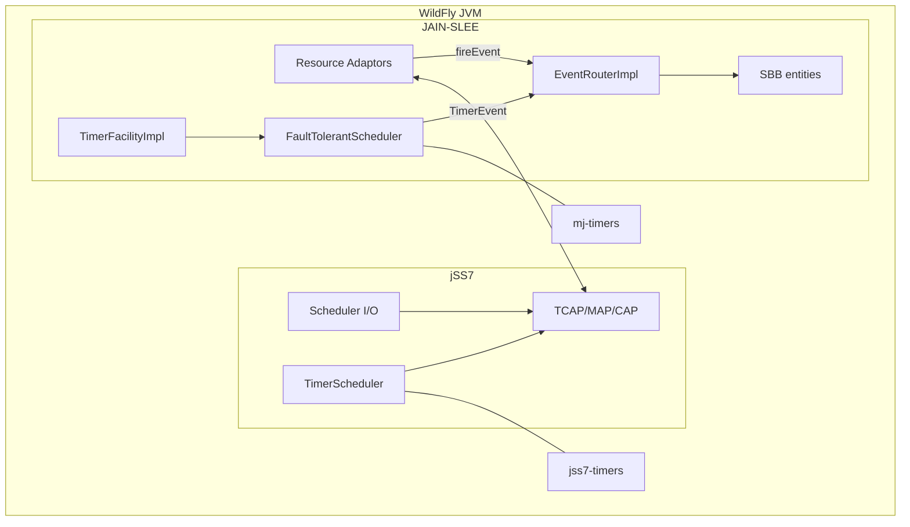

# JAIN-SLEE ↔ jSS7 Scheduler Integration Report

**Version:** jSS7 9.5.0 / RestComm JAIN-SLEE  
**Last updated:** 2026-06-25

---

## Executive Summary

| Question | Verdict |
|----------|---------|
| Can jSS7 `Scheduler` (I/O) replace JAIN-SLEE event execution? | **No** |
| Can jSS7 `TimerScheduler` replace JAIN-SLEE `TimerFacility`? | **Not drop-in** — adapter behind `TimerFacilityImpl` only |
| Recommended approach | **Keep subsystems separate**; share WildFly/Infinispan infra optionally |

---

## Subsystem Map

| jSS7 | JAIN-SLEE (Mobicents) | Purpose |
|------|----------------------|---------|
| `Scheduler` + `QueueId` | `EventRouterImpl` + Disruptor | **Different** — I/O vs SBB events |
| `TimerScheduler` | `TimerFacilityImpl` + `FaultTolerantScheduler` | **Partial overlap** — protocol vs SBB timers |

---

## JAIN-SLEE Timers (production)

| Class | Path |
|-------|------|
| `javax.slee.facilities.TimerFacility` | `jain-slee/jain-slee/api/jar/.../TimerFacility.java` |
| `TimerFacilityImpl` | `jain-slee/jain-slee/container/timers/.../TimerFacilityImpl.java` |
| `FaultTolerantScheduler` | `cluster/timers/.../FaultTolerantScheduler.java` |
| `TimerFacilityTimerTask` | fires `TimerEvent` via `ActivityContext.fireEvent()` |

**Spec obligations:** JTA-deferred set/cancel, `TimerID`, periodic + `TimerPreserveMissed`, AC attachment, delivery via Event Router (never direct SBB call).

**Micro stub (not production):** `com.microjainslee.core.HierarchicalTimingWheel` — unused `ScheduledExecutorService` placeholder.

---

## JAIN-SLEE Event Execution (production)

```
RA / TimerFacility
  → ActivityContextImpl.fireEvent()
  → ActivityEventQueueManagerImpl (tx barriers)
  → EventRouterExecutor (Disruptor × N, AC-pinned)
  → EventRoutingTaskImpl → SBB tree
```

| Class | Role |
|-------|------|
| `EventRouterImpl` | Orchestrator |
| `DisruptorEventRouterExecutorImpl` | Default executor |
| `ActivityHashingEventRouterExecutorMapper` | AC → executor pin |
| `ActivityEventQueueManagerImpl` | Transactional ordering |

---

## jSS7 Schedulers

### I/O `Scheduler`
- 4 ms cycle, 11 priority queues, batch dispatch to thread pool
- For SCTP/M3UA/SCCP/TCAP I/O ordering — **not** SBB execution

### `TimerScheduler`
- `LocalTimerAdapter` — Netty `HashedWheelTimer` (10 ms)
- `InfinispanTimerAdapter` — WildFly JNDI TTL + expiration listener
- Callback on timer thread; grouped by `dialogId`; no JTA, no `TimerID`

---

## Integration Assessment

### I/O Scheduler → Event Router: **No**

| Dimension | JAIN-SLEE | jSS7 `Scheduler` |
|-----------|-----------|------------------|
| Work unit | `EventContext` → SBB | `Task.perform()` I/O |
| Ordering | Per Activity Context | Per `QueueId` |
| Transactions | JTA-integrated | None |

**Acceptable:** RA uses jSS7 stack I/O internally; delivers to SLEE via `ActivityContext.fireEvent()`.

### TimerScheduler → TimerFacility: **Adapter only**

| Capability | `FaultTolerantScheduler` | `TimerScheduler` |
|------------|-------------------------|------------------|
| API | `javax.slee.TimerFacility` | `schedule(record, delay, callback)` |
| Fire path | `TimerEvent` → Event Router | Direct callback |
| Cluster | `TimerTaskData` + recovery | TTL metadata; callback not portable |
| JTA | Yes | No |

---

## Recommended Architecture



**Boundary rule:** Protocol time → jSS7 `TimerScheduler`; SBB time → `TimerFacility`; SBB events → `EventRouter`; wire I/O → jSS7 `Scheduler`.

---

## Phased Migration

| Phase | Scope | Duration |
|-------|-------|----------|
| 0 | Instrumentation, cache isolation | 2–3 weeks |
| 1 | RA audit: no SBB calls from jSS7 threads | 4–6 weeks |
| 2 | `SleeTimerSchedulerBridge` behind `TimerFacilityImpl` (feature flag) | 6–8 weeks |
| 3 | HA: `microjainslee` Infinispan + callback rehydration | 8–12 weeks |
| 4 | Performance tuning (separate from jSS7 cycle) | ongoing |
| 5 | TCK + production cutover | gate |

### Phase 2 sketch (`SleeTimerSchedulerBridge`)

```java
// On fire — NEVER call SBB on timer thread
timerBackend.schedule(record, delay, r ->
    eventRouterExecutor.execute(() -> ac.fireEvent(TIMER_EVENT, ...)));

// Preserve JTA: SetTimerAfterTxCommitRunnable pattern from TimerFacilityImpl
```

---

## Risks

| Risk | Mitigation |
|------|------------|
| SBB on timer thread | Post to Event Router always |
| Shared Infinispan cache | Separate `jss7` vs `microjainslee` containers |
| TCK timer semantics | Keep `FaultTolerantScheduler` as fallback until Phase 5 |
| Failover without callback rehydration | Document limitation; complete Phase 3 before HA claim |

---

## Conclusion

jSS7 and JAIN-SLEE schedulers are **orthogonal**. Integration value is infrastructure sharing (WildFly, Netty wheel patterns) and strict boundaries — not subsystem replacement. Replace `HierarchicalTimingWheel` stub in micro-jainslee with `LocalTimerAdapter`; keep Mobicents `EventRouterImpl` and `TimerFacilityImpl` as sole SBB paths until a spec-compliant adapter passes TCK.

See also: [`INFINISPAN_TIMER_GUIDE.md`](INFINISPAN_TIMER_GUIDE.md) §6.5 (separate cache for co-deployed apps).
