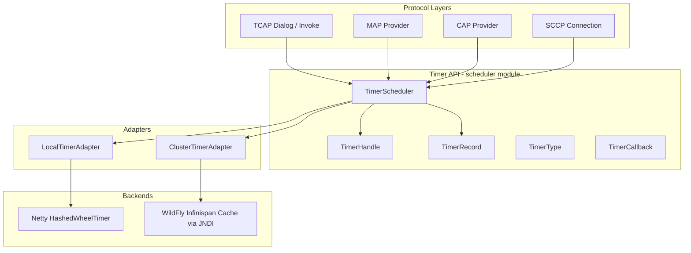
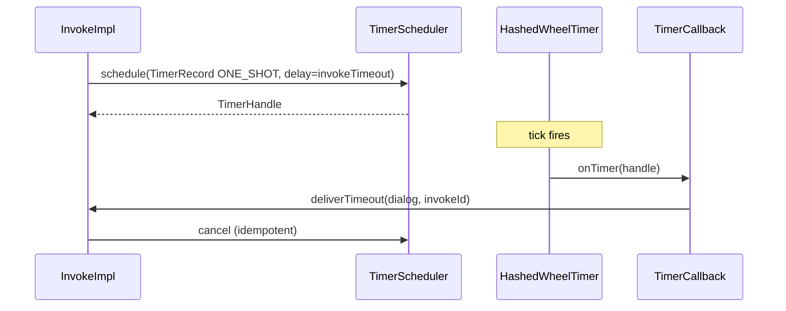
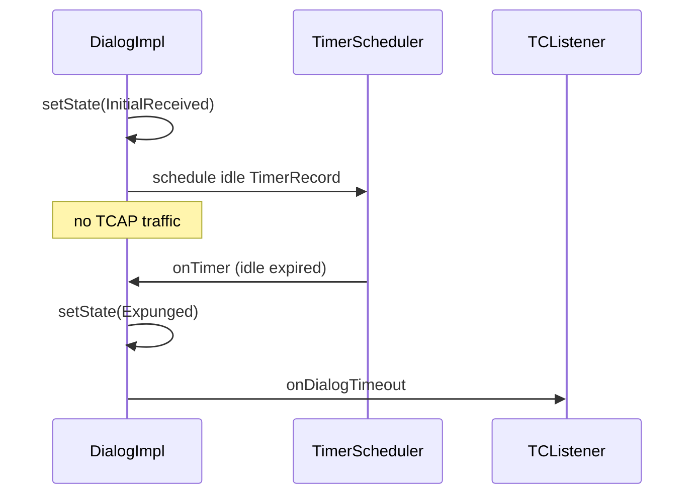

# jSS7 Timer Refactor Plan (9.4.0)

**Status:** Implemented (9.4.0)  
**Target release:** 9.4.0  
**Last updated:** 2026-06-25

---

## Executive Summary

jSS7 9.4.0 introduces a unified, protocol-safe timer subsystem to replace the current ad-hoc use of `ScheduledExecutorService`, `Future.cancel()`, and scheduler heartbeat tasks across TCAP, MAP, CAP, SCCP, ISUP, and M3UA.

Today, timers are fragmented:

| Layer | Current mechanism | Pain points |
|-------|-------------------|-------------|
| **Scheduler** (`scheduler/`) | 4 ms `CpuThread` cycle with `Object.wait/notify`, `Thread.sleep` pacing | Shutdown does not join thread or drain `ExecutorService`; magic `Thread.sleep(40)` in `stop()` |
| **TCAP** | `Executors.newScheduledThreadPool(4)` per provider | Dialog idle + invoke timers; no clustering; shutdown race with in-flight callbacks |
| **SCCP** | `ScheduledExecutorService` pool (`timerExecutors`) | Connection timers (EST, IAS, IAR, REL, …) independent of TCAP |
| **ISUP** | Scheduler `Task` on `HEARTBEAT_QUEUE` | T1–T38 implemented as recurring heartbeat tasks, not wall-clock timers |
| **MAP/CAP** | Inherit TCAP dialog/invoke timeouts | No application-layer timer abstraction |

**Goals:**

1. Fix scheduler lifecycle and timing precision (Phases 1–4).
2. Introduce a small, immutable timer API decoupled from `java.util.concurrent` (Phase 5).
3. Provide a single-node Netty `HashedWheelTimer` backend (Phase 6).
4. Migrate protocol stacks incrementally, preserving 3GPP timer semantics and dialog state machines (Phases 7–8).
5. Enable HA timer failover via WildFly-managed Infinispan caches looked up through JNDI — **no embedded Infinispan inside jSS7** (Phase 9).

**Non-goals for 9.4.0:**

- Rewriting ISUP T-timers off the heartbeat queue (deferred; documented as follow-up).
- Changing MAP/CAP ASN semantics or transaction state machines.
- Embedding Infinispan or JGroups inside jSS7 JARs.

---

## Architecture Overview



---

## Phase 1–4: Scheduler Fixes

These phases harden the existing `org.restcomm.protocols.ss7.scheduler.Scheduler` without changing its external queue semantics. Each phase is an independently reviewable PR.

### PR-01: Graceful Shutdown

**Problem:** `Scheduler.stop()` sets `active = false` on `CpuThread` but never joins the thread, never shuts down the inner `ThreadPoolExecutor`, and relies on `Thread.sleep(40)` as a best-effort drain.

```143:159:jSS7/scheduler/src/main/java/org/restcomm/protocols/ss7/scheduler/Scheduler.java
    public void stop() {
        if (!this.isActive) {
            return;
        }

        cpuThread.shutdown();

        try {
            Thread.sleep(40);
        } catch (InterruptedException e) {
        }

        for (int i = 0; i < taskQueues.length; i++)
            taskQueues[i].clear();

        heartBeatQueue.clear();
    }
```

**Changes:**

- Add `volatile boolean isActive` guard (already present) and set `isActive = false` in `stop()` before signaling shutdown.
- `CpuThread.shutdown()`:
  - Set `active = false`.
  - `LockSupport.unpark(cpuThread)` or `synchronized(LOCK) { LOCK.notifyAll(); }` to wake any `wait()`.
  - `cpuThread.join(shutdownTimeoutMs)` with configurable default (e.g. 5 s).
  - `eservice.shutdown()` → `awaitTermination` → `shutdownNow()` on timeout.
- Remove `Thread.sleep(40)`.
- `start()` must reject re-start after full shutdown (new instance required).

**Acceptance:** No thread leak after 1000 start/stop cycles; no tasks executed after `stop()` returns.

---

### PR-02: CountDownLatch Shutdown Coordination

**Problem:** In-flight tasks submitted to `eservice` may still call `notifyCompletion()` after `stop()` begins, causing spurious `notify()` on a shutting-down scheduler.

**Changes:**

- Add `CountDownLatch drainLatch` initialized to 0; increment before `eservice.execute(t)`, decrement in `Task.run()` finally block (via `notifyCompletion()`).
- `stop()` waits on latch with timeout after executor shutdown.
- Replace bare `Object.wait()` with `awaitDrainOrCycle()` that checks `active` flag.

**Acceptance:** `stop()` returns only when `drainLatch.getCount() == 0` or timeout logged at WARN.

---

### PR-03: `LockSupport.parkNanos` Cycle Pacing

**Problem:** `CpuThread` uses `Thread.sleep(4ms - elapsed)` for cycle pacing. `sleep()` is coarse, ignores spurious wakeups poorly, and conflates "wait for tasks" with "wait for next cycle."

```241:249:jSS7/scheduler/src/main/java/org/restcomm/protocols/ss7/scheduler/Scheduler.java
                cycleDuration = System.nanoTime() - cycleStart;
                if (cycleDuration < 4000000L) {
                    try {
                        sleep(4L - cycleDuration / 1000000L, (int) ((4000000L - cycleDuration) % 1000000L));
                    } catch (InterruptedException e) {
                        // lets continue
                    }
                }
```

**Changes:**

- Separate **task wait** (`LockSupport.parkNanos` on `LOCK` with deadline) from **cycle wait** (park remaining slice of 4 ms).
- Use `System.nanoTime()` deadline: `long nextCycle = cycleStart + 4_000_000L; LockSupport.parkNanos(nextCycle - System.nanoTime())`.
- On `notifyCompletion()`, unpark only if `activeTasksCount == 0`.
- Preserve 4 ms cadence; add metric hook (optional) for overrun > 4.1 ms.

**Acceptance:** Cycle jitter p99 < 0.5 ms under load test; no `Thread.sleep` in `CpuThread`.

---

### PR-04: `QueueId` Enum

**Problem:** Queue indices are raw `Integer` constants (`MANAGEMENT_QUEUE = 0` … `L2WRITE_QUEUE = 10`, `HEARTBEAT_QUEUE = -1`). Typos and magic numbers propagate to M3UA, ISUP, SCTP, shell.

**Changes:**

```java
public enum QueueId {
    MANAGEMENT(0),
    L2READ(1), L3READ(2), L4READ(3), TCAP_READ(4), APP_READ(5),
    APP_WRITE(6), TCAP_WRITE(7), L4WRITE(8), L3WRITE(9), L2WRITE(10),
    HEARTBEAT(-1);

    private final int index;
    // getIndex(), fromIndex(int) with validation
}
```

- Add `Scheduler.submit(Task task, QueueId queue)`; deprecate `Integer` overload (remove in 9.4.0).
- Update call sites: `ShellServer`, `Mtp3UserPartBaseImpl`, ISUP `Circuit`, M3UA scheduler, congestion layer.
- `INTERNETWORKING_QUEUE` becomes alias: `QueueId.L4READ`.

**Acceptance:** All scheduler submit call sites compile with enum; no raw queue integers in new code.

---

## Phase 5: Timer API

New package: `org.restcomm.protocols.ss7.scheduler.timer` (module: `scheduler`).

### Types

| Type | Responsibility |
|------|----------------|
| `TimerType` | `ONE_SHOT`, `FIXED_DELAY` (future: `FIXED_RATE`) |
| `TimerCallback` | `@FunctionalInterface void onTimer(TimerHandle handle)` — invoked on scheduler thread or timer wheel thread per adapter config |
| `TimerRecord` | Immutable value object: `UUID id`, `TimerType type`, `long delayMs`, `long periodMs`, `TimerCallback callback`, `Object attachment` |
| `TimerHandle` | Opaque cancel/reschedule surface: `cancel()`, `isCancelled()`, `getRecord()` |
| `TimerScheduler` | Facade: `schedule(TimerRecord)`, `cancel(UUID)`, `shutdown()` |

### Design rules

- **Immutable** `TimerRecord` — reschedule = cancel + new record.
- Callbacks must be **non-blocking**; protocol code dispatches to existing `QueueId` queues.
- `TimerScheduler` is **interface**; implementations in Phase 6/9.
- No `java.util.concurrent.Future` leakage into protocol layers.

### Sequence: one-shot invoke timeout



---

## Phase 6: LocalTimerAdapter + Netty HashedWheelTimer

Single-node (non-clustered) WildFly or standalone JVM.

### `LocalTimerAdapter implements TimerScheduler`

- Wrap `io.netty.util.HashedWheelTimer` (already on classpath via `netty.version=4.2.11.Final`).
- Config: `tickDurationMs` (default 10), `ticksPerWheel` (default 512), thread name `jss7-timer-%d`.
- Map `UUID → Timeout` for cancel.
- `shutdown()`: `timer.stop()` + await in-flight callbacks (CountDownLatch).

### Wiring

- `TimerSchedulerFactory.createLocal(Properties)` — used when JNDI cache unavailable.
- SS7 service / WildFly extension selects adapter at stack boot.

### Why HashedWheelTimer

- O(1) insert, suitable for thousands of TCAP invoke timers.
- Coalesced ticks reduce context switches vs per-task `ScheduledThreadPoolExecutor` threads.
- Netty already a jSS7 dependency; no new third-party timer library.

---

## Phase 7: TCAP Refactor

**Scope:** `tcap-impl`, `tcap-ansi-impl`.

### Current state

- `TCAPProviderImpl._EXECUTOR = Executors.newScheduledThreadPool(4)` (line ~592).
- `createOperationTimer()` → `_EXECUTOR.schedule(...)`.
- `DialogImpl` idle timer via `executor.schedule(IdleTimerTask, ...)`.
- `InvokeImpl` holds `Future timerFuture`.

### Migration steps

1. Inject `TimerScheduler` into `TCAPStackImpl` / `TCAPProviderImpl` (constructor or setter; default `LocalTimerAdapter`).
2. Replace `createOperationTimer(Runnable, long)` with `timerScheduler.schedule(TimerRecord)`.
3. `InvokeImpl`: store `TimerHandle` instead of `Future`; cancel on response/error.
4. `DialogImpl`: idle timer via `TimerHandle`; preserve `structured` / `previewMode` guards.
5. `stop()`: `timerScheduler.shutdown()` after dialog registry cleared (order matters — MAP dialog state machine).
6. Remove `_EXECUTOR` field once all usages migrated.

### Protocol compliance

| Timer | 3GPP / ITU ref | Must preserve |
|-------|----------------|---------------|
| Invoke timeout | Q.773 / TCAP | TC-U-ABORT or local cancel |
| Dialog idle | Operator config (`dialogTimeout`) | `TRPseudoState.Expunged` transition |
| Preview mode | N/A | No timers started |

### Sequence: dialog idle timeout



---

## Phase 8: MAP/CAP Refactor

**Scope:** `map-impl`, `cap-impl` (application-layer timers only).

### Dependency

MAP and CAP do **not** own wall-clock executors today; they rely on TCAP dialog/invoke lifecycle. Phase 8 adds:

1. **Optional application timers** (e.g. CAP `ApplyCharging`, `CallGap` guard timers) via shared `TimerScheduler` from TCAP provider.
2. **API exposure:** `MAPProvider.getTimerScheduler()` / `CAPProvider.getTimerScheduler()` delegating to TCAP.
3. Replace any direct `ScheduledExecutorService` in `map/load` tools with injected scheduler (test/load harness only).

### MAP considerations

- Dialog releasing must cancel all outstanding `TimerHandle`s (invoke + app-level).
- No change to `MAPDialogImpl` state enum values.

### CAP considerations

- Circuit-switched call timers (`ResetTimer`, `ApplyChargingReport`) map to `TimerType.ONE_SHOT`.
- CAMEL phase compatibility: timer start/stop/Re-start semantics unchanged at ASN level.

---

## Phase 9: Infinispan Clustering via WildFly JNDI

**Constraint:** jSS7 must **not** embed Infinispan. All distributed timer state lives in the WildFly Infinispan subsystem; jSS7 looks up caches via JNDI.

### Reference pattern

Existing Restcomm clustering (`cluster/timers`) uses `MobicentsCluster` + `FaultTolerantScheduler` with cache-backed `TimerTaskCacheData`. Phase 9 adapts this pattern for jSS7 9.3:

### `ClusterTimerAdapter implements TimerScheduler`

1. On WildFly boot, extension binds `TimerScheduler` JNDI name:  
   `java:jboss/ss7/timerScheduler`
2. Lookup Infinispan cache:  
   `java:jboss/infinispan/container/jss7/cache/ss7-timers`
3. `TimerRecord` serialized to cache entry keyed by `UUID`.
4. Only **cluster coordinator** (or partition owner) fires wheel tick for a bucket — use WildFly `ServiceController` + JGroups channel already provided by `jboss-as-clustering-infinispan`.
5. Failover: new owner scans cache for `deadline < now`, reschedules on local wheel.
6. TX boundary: schedule after SCCP/TCAP transaction commit (pattern from `SetTimerAfterTxCommitRunnable` in `cluster/timers`).

### JNDI lookup (pseudo)

```java
Context ctx = new InitialContext();
Cache<String, TimerRecord> cache = (Cache<String, TimerRecord>)
    ctx.lookup("java:jboss/infinispan/container/jss7/cache/ss7-timers");
```

### WildFly extension changes

- `service/wildfly/extension`: add optional `<timer-clustering enabled="true" cache-container="jss7"/>`.
- Module `org.restcomm.protocols.ss7` depends on `org.infinispan` **provided** scope (WildFly module only).

---

## `standalone.xml` — jSS7 Cache Container Snippet

Add inside `<subsystem xmlns="urn:jboss:domain:infinispan:4.0">`:

```xml
<!-- jSS7 clustered timer state.
     JNDI: java:jboss/infinispan/container/jss7
     Cache:  java:jboss/infinispan/container/jss7/cache/ss7-timers -->
<cache-container name="jss7"
                 default-cache="ss7-timers"
                 module="org.wildfly.clustering.server">
    <!-- Single-node dev profile -->
    <local-cache name="ss7-timers">
        <locking isolation="READ_COMMITTED" acquire-timeout="30000"/>
        <transaction mode="BATCH"/>
        <expiration lifespan="-1" max-idle="3600000"/>
    </local-cache>
</cache-container>
```

**HA profile** (`standalone-full-ha.xml`): replace `local-cache` with:

```xml
<cache-container name="jss7"
                 default-cache="ss7-timers"
                 module="org.wildfly.clustering.server">
    <transport lock-timeout="60000"/>
    <distributed-cache name="ss7-timers" owners="2" segments="64">
        <locking isolation="READ_COMMITTED" acquire-timeout="30000"/>
        <transaction mode="BATCH"/>
        <expiration lifespan="-1" max-idle="3600000"/>
    </distributed-cache>
</cache-container>
```

---

## Test Strategy

### Unit tests (per phase)

| Phase | Tests |
|-------|-------|
| PR-01–03 | `SchedulerShutdownTest`: start/stop × 1000, no leaked threads; `SchedulerTimingTest`: mock `Clock`, assert 4 ms cadence |
| PR-04 | Compile-time enum coverage; `QueueIdTest.fromIndex` bounds |
| Phase 5 | `TimerRecord` immutability, `TimerHandle` idempotent cancel |
| Phase 6 | `LocalTimerAdapterTest`: schedule/cancel/reschedule; wheel tick accuracy ± 1 tick |
| Phase 7 | Existing `TCAPAbnormalTest.invokeTimeoutTest*`, `PreviewModeFunctionalTest.dialogTimeoutTest` — green without `ScheduledExecutorService` |
| Phase 8 | CAP `ResetTimerTest`; MAP dialog release cancels handles |
| Phase 9 | Integration test on WildFly Arquillian: kill node, assert timer fires on survivor |

### Load / regression

- `map/load` harness with `Ss7ThreadPoolTuner` updated for `TimerScheduler`.
- Heap dump after 1M invoke timeouts — no `TimerHandle` leak.
- CI: scheduler + tcap-impl + cap-impl modules.

### Manual / staging

- Two-node WildFly HA, TCAP dialog idle + invoke timeout during failover.
- Graceful rolling restart: no duplicate TCAP aborts.

---

## Risks

| Risk | Impact | Mitigation |
|------|--------|------------|
| Callback runs on timer thread | MAP/TCAP deadlock if callback blocks | Document + assert in debug; dispatch to `QueueId.TCAP_READ` |
| HashedWheelTimer granularity | Sub-10 ms timeouts inaccurate | Document min resolution; use 10 ms tick |
| Cluster clock skew | Premature/late failover timers | Logical deadline stored as `System.nanoTime()` offset at schedule time |
| Serialization of `TimerCallback` | Cluster mode cannot persist lambdas | Store `TimerTaskDescriptor` (class name + dialogId + invokeId); factory rehydrates |
| ISUP heartbeat timers untouched | Inconsistent timer infra | Document deferral; ISUP uses scheduler Tasks, not `TimerScheduler` |
| WildFly module coupling | Standalone JVM needs local adapter | `TimerSchedulerFactory` auto-detect: JNDI present → cluster, else local |

---

## Acceptance Criteria (9.4.0 Release)

1. **Scheduler:** `stop()` joins threads, shuts down executor, zero `Thread.sleep` in `CpuThread`.
2. **API:** Protocol code does not import `java.util.concurrent.ScheduledExecutorService` for TCAP timers.
3. **TCAP:** All existing TCAP timer unit/integration tests pass unchanged behavior.
4. **MAP/CAP:** Dialog release cancels all timers; no orphan callbacks after `TCEnd`.
5. **Local mode:** Single-node WildFly + standalone simulator work with `LocalTimerAdapter`.
6. **Cluster mode:** With `standalone-full-ha.xml` snippet deployed, TCAP invoke timeout survives single node failure within 2× `invokeTimeout`.
7. **No embedded Infinispan:** `jSS7/pom.xml` has no `infinispan-core` compile dependency; only `provided` in WildFly extension.
8. **Version:** All modules at `9.4.0`; WildFly module assembly packages `*-9.4.0.jar`.

---

## Implementation Order & PR Map

| PR | Phase | Module(s) | Depends on |
|----|-------|-----------|------------|
| PR-01 | Scheduler shutdown | `scheduler` | — |
| PR-02 | CountDownLatch drain | `scheduler` | PR-01 |
| PR-03 | parkNanos pacing | `scheduler` | PR-01 |
| PR-04 | QueueId enum | `scheduler`, callers | PR-01 |
| PR-05 | Timer API types | `scheduler` | PR-04 |
| PR-06 | LocalTimerAdapter | `scheduler` | PR-05 |
| PR-07 | TCAP migration | `tcap-impl`, `tcap-ansi-impl` | PR-06 |
| PR-08 | MAP/CAP delegation | `map-impl`, `cap-impl` | PR-07 |
| PR-09 | Cluster adapter + WF extension | `service/wildfly`, `scheduler` | PR-06, PR-07 |
| PR-10 | Docs + standalone.xml sample | `docs`, deployment guides | PR-09 |

---

## Follow-Up (Post-9.4.0)

### Phase 10 — SCCP / ISUP / M3UA timer migration (deferred 9.4.0)

| Layer | Current | Timer count / types | Migration notes |
|-------|---------|---------------------|-----------------|
| **SCCP** (`SccpStackImpl`) | `ScheduledExecutorService timerExecutors` | 10+ connection timers: EST, IAS, IAR, REL, repeat REL, INT, guard, reset, reassembly, SST (min/max with backoff), Ta/Td congestion | High value: connection-scoped `cancelAll(sccpConnId)` mirrors TCAP dialog pattern. Use `TimerType.SCCP_*` enum extension. |
| **M3UA** (`M3UAManagementImpl`) | `ScheduledExecutorService fsmTicker` | ASP/AS FSM tick + heartbeat | Lower priority: FSM ticker is periodic sweep, not per-dialog TTL. Consider keeping `fsmTicker` or migrate to `QueueId.L3WRITE` heartbeat Task. |
| **ISUP** | Scheduler `Task` on `HEARTBEAT_QUEUE` | T1–T38 as recurring heartbeat tasks | Largest effort: must preserve Q.764 timing semantics and switch from tick-count to wall-clock `TimerScheduler`. Dispatch callbacks to `QueueId.L4READ`. |

**Recommendation:** SCCP first (9.4.0), then ISUP (9.5.0), M3UA optional.

### Phase 11 — Distributed dialog state (epic, separate from timers)

Timer HA (Infinispan TTL expiry) only survives **timer metadata** across node failure. Full dialog continuity requires:

1. **Dialog registry cache** — serialize `DialogImpl` / `MAPDialogImpl` / `CAPDialogImpl` state (invoke table, sequence numbers, preview keys) to Infinispan `jss7-dialogs` cache keyed by `localTransactionId`.
2. **Sticky routing** — SCCP/M3UA must route subsequent messages to the node owning the dialog (or any node with cache lookup).
3. **Ownership transfer** — on node death, survivor loads dialog from cache, re-schedules timers via existing `InfinispanTimerAdapter`.
4. **State machine safety** — MAP/CAP/TCAP transitions must be serializable; no `TimerCallback` lambdas in cache (use `TimerTaskDescriptor` rehydration already designed in Phase 9).
5. **WildFly config** — add `jss7-dialogs` distributed cache alongside `jss7-timers` in `standalone-patched.xml`.

**Deployed:** `ussdgateway/release-wildfly/standalone-patched.xml` now includes `jss7` cache-container (JNDI `java:jboss/infinispan/container/jss7`).

**Non-goals for 9.4.0:** Full dialog migration — timers only.

- Deprecate `Integer` queue overload removal (9.4.0).
- Metrics: Micrometer timer for active handles, fired/expired/cancelled counters.
